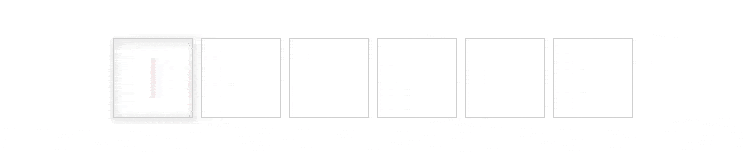

# react-native-pin-input-component
This is a cross-platform, lightweight, customizable PIN input component for React Native

# Features:
- Customizable style to normal, focus or blur Cell style
- Pass component to cell as props
- Easy to customize
- Compatible with most react native version

# Installation
```sh
#npm
npm i react-native-pin-input-component
```
# Use
```js
...
import PinInput from 'react-native-pin-input-component';

render(){
    return(
       <View>
           ...
           <PinInput
               autoFocus
               value={value}
               onPress={() => {}}
               onChangeText={text => {
               this.setState({value: text});
                        }}
                />
            ...
       </View>
    )
}
```
## Examples
### Default style


```js
<PinInput
  autoFocus
  value={value}
  onPress={() => {}}
  onChangeText={text => {
    this.setState({value: text});
  }}
/>;
```
### Visible Selection


```js
<PinInput
  value={value}
  onPress={() => {}}
  onChangeText={text => {
    this.setState({value: text});
  }}
  visibleSelection
/>;
```
### Customizable style


```js
const styles = StyleSheet.create({
  ...
  normal: {
    width: 40,
    height: 40,
    borderWidth: 0.5,
    borderColor: '#D5D5D5',
    justifyContent: 'center',
    alignItems: 'center',
    margin: 2,
    borderRadius: 20,
  },
  focus: {
    width: 40,
    height: 40,
    borderWidth: 0.5,
    borderColor: 'red',
    justifyContent: 'center',
    alignItems: 'center',
    margin: 2,
    borderRadius: 20,
    ...Platform.select({
      ios: {
        shadowOffset: {width: 0, height: 1},
        shadowRadius: 2,
        shadowOpacity: 0.5,
        shadowColor: 'red',
      },
      android: {
        elevation: 4,
      },
    }),
  },
  blur: {
    width: 40,
    height: 40,
    borderRadius: 20,
    justifyContent: 'center',
    alignItems: 'center',
    margin: 2,
  },
  ...
});

render(){
   return(
        ...
        <PinInput
          value={value}
          onPress={() => {}}
          onChangeText={text => {
            this.setState({value: text});
          }}
          cellNormalStyle={styles.normal}
          cellFocusStyle={styles.focus}
          cellBlurStyle={styles.blur}
        />;
        ...
        );
}
...
```
# Available props
|Name|Type|Required|Default|Description|
|----|----|--------|-------------------------------------------------------------------------------|---------------------------|
|value|String|yes||The value to show for the input|
|length|Number|no|6|Number of charater for the pin input|
|autoFocus|Boolean|no|false|If true, focuses the pin input|
|onChangeText|Function|yes||Same onChangeText function of TextInput|
|visibleSelection|Boolean|no|false|If true, visible selection|
|selectionColor|String|no|'red'|Color string of selection when `visibleSelection=true`|
|cellNormalStyle|Style Object|no|`{width: 40,height: 40,borderWidth: 0.5,borderColor: '#D5D5D5',justifyContent: 'center',alignItems: 'center',margin: 2,}`|Normal style object of cell|
|cellFocusStyle|Style Object|no|`{width: 40, height: 40, borderWidth: 0.5, borderColor: '#D5D5D5', justifyContent: 'center', alignItems: 'center', margin: 2, ...Platform.select({ ios: { shadowOffset: { width: 0, height: 1 }, shadowRadius: 2, shadowOpacity: 0.5, }, android: { elevation: 4, }, }),}`| Focus style object of cell|
|cellBlurStyle|Style Object|no|`{width: 40, height: 40, justifyContent: 'center', alignItems: 'center', margin: 2,}`|Blur style object of cell|
|CellView|React Native Component|no||React Native Component pass to PinInput as props, you can set your component if you want|
|FocusView|React Native Component|no||Component display when cell focuses, you pass your component if you want|
|BlurView|React Native Component|no||Component display when cell focuses, you pass your component if you want|
